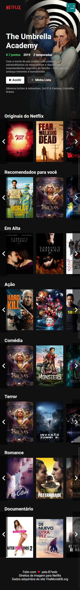

  

  
  
  
  
	
  

## 💻 Projeto

# Netflix clone

Netflix clone é um projeto feito em react usando a API do TMDB. Foi feito usando a live do [Bonieky Lacerda](https://www.youtube.com/watch?v=tBweoUiMsDg).

## - 🌐 Web

> https://netflix-clone-tmdb.netlify.app/

### 🖥️ Desktop

<h1 align="center">
    
</h1>

### 📱 Mobile

    

## ⚙️ API

[TMDB](https://www.themoviedb.org/documentation/api)
